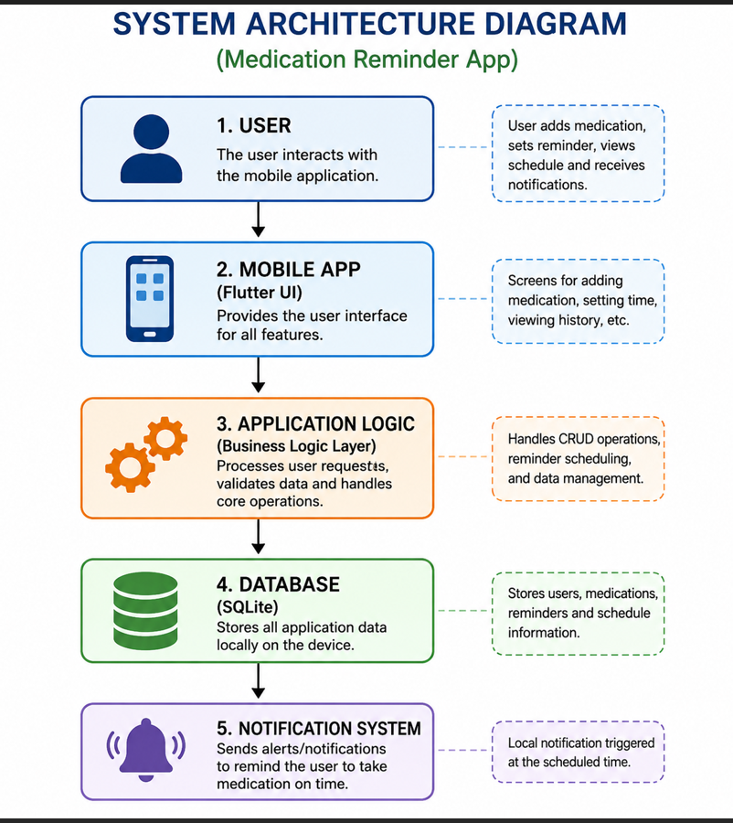

# System Architecture

## Architecture Style
The system follows a **Layered Architecture** approach to separate concerns and improve maintainability.

## Components

1. Presentation Layer (Flutter UI)
- Displays screens
- Accepts user input

2. Application Logic Layer
- Processes user actions
- Handles business rules

3. Data Layer (SQLite Database)
- Stores users, medications, reminders

4. Notification System
- Schedules and triggers reminders

## Architecture Diagram

## Explanation
The user interacts with the mobile app UI. The application logic processes requests and communicates with the database to store or retrieve data. The notification system triggers alerts based on scheduled reminders.