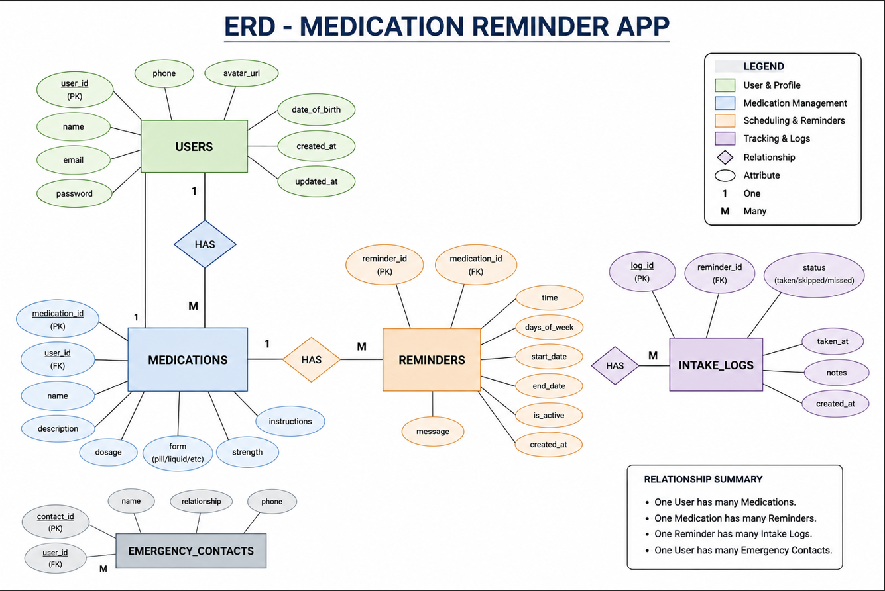

# Database Design (ERD)

## Entities

### 1. User
- user_id (Primary Key)
- name
- email

### 2. Medication
- medication_id (Primary Key)
- name
- dosage
- frequency
- user_id (Foreign Key)

### 3. Reminder
- reminder_id (Primary Key)
- time
- date
- medication_id (Foreign Key)

## Relationships

- One User can have many Medications
- One Medication can have many Reminders

## ERD Diagram

